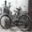
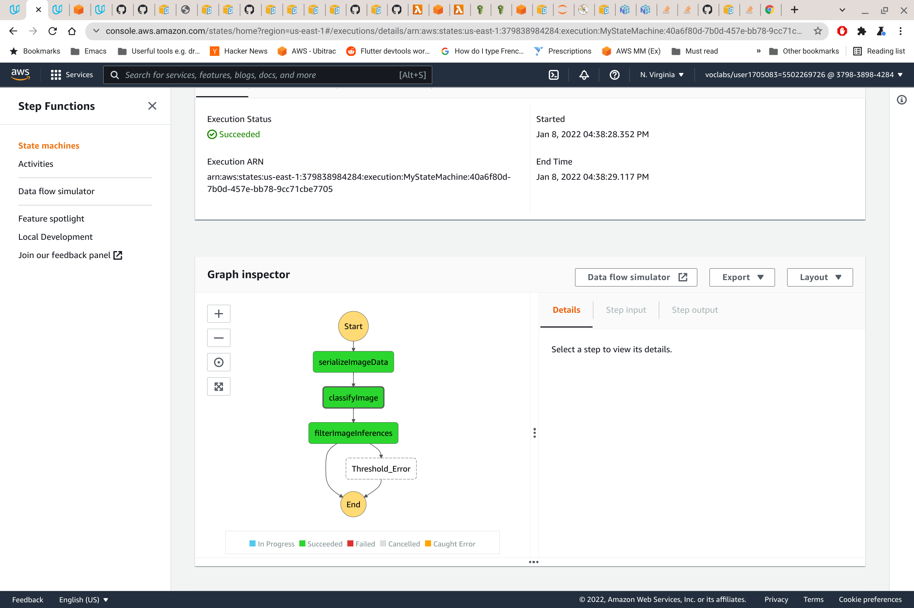

# ML Workflow for Classifying Images

This project uses AWS services to train, deploy and monitor a model for classifying images of vehicle.

The CIFAR dataset is used for training and testing images. Only images of vehicles are selected and uploaded to an S3 bucket.

A SageMaker Estimator is used, with an "image-classification" image to train the model.

TODO show results of training and results

The trained model is deployed with a Model Monitor so that the model's performance can be monitored.

Loading images, training, deploying, testing and monitoring can all be seen in operation in the Jupyter Notebook - ML_Workflow.ipynb

AWS lambda functions (in the lambdas/) are used to classify images:
 - detect images uploaded to S3 that need to be classified (startImageClassifyStepFunction)
 - load images from S3 (serializeImageData)
 - classify image (classifyImage)
 - filter out those with a low confidence, writing these to a fail S3 folder and publishing to an SNS topic (filterImageInferences)

These three lambda functions are integrated using a Step Function so that images uploaded to S3 are classified.

The classification result of any images that could not be classied with any degree of confidence are stored in the image_classification_fail folder and published to an SNS topic.

The classification result of any images that have been classified with a high degree of confidence are stored in the image_classification_output folder

